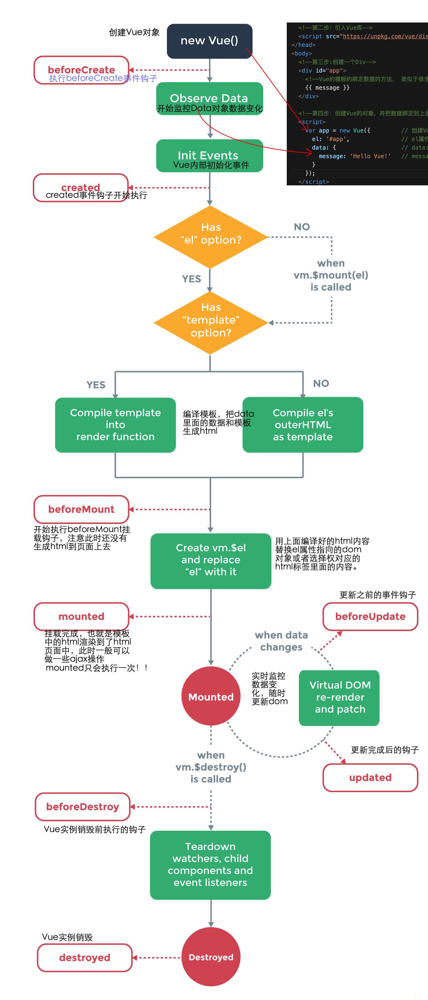

## Vue实例的生命周期
* Vue实例有一个完整的生命周期，也就是从开始创建、初始化数据、编译模板、挂载Dom、渲染→更新→渲染、销毁等一系列过程，我们称这是Vue的生命周期。



#### vue生命周期

* beforeCreate

在实例初始化之后，数据观测(data observer) 和 event/watcher 事件配置之前被调用。

* created

实例已经创建完成之后被调用。在这一步，实例已完成以下的配置：数据观测(data observer)，
属性和方法的运算， watch/event 事件回调。然而，挂载阶段还没开始，$el 属性目前不可见。

* beforeMount

在挂载开始之前被调用：相关的 render 函数首次被调用。

* mounted
el 被新创建的 vm.$el 替换，并挂载到实例上去之后调用该钩子。如果 root 实例挂载了一个文档内元素，
当 mounted 被调用时 vm.$el 也在文档内。

* beforeUpdate
数据更新时调用，发生在虚拟 DOM 重新渲染和打补丁之前。 你可以在这个钩子中进一步地更改状态，这不会触发附加的重渲染过程。

* updated
由于数据更改导致的虚拟 DOM 重新渲染和打补丁，在这之后会调用该钩子。

该钩子在服务器端渲染期间不被调用。

* beforeDestroy
实例销毁之前调用。在这一步，实例仍然完全可用。

* destroyed
Vue 实例销毁后调用。调用后，Vue 实例指示的所有东西都会解绑定，所有的事件监听器会被移除，所有的子实例也会被销毁。 该钩子在服务器端渲染期间不被调用。

接下来我们做一个例子，看一下Vue中所有的生命周期怎么用的。
```ecmascript 6
    import Axios from 'axios'       // 这是一个轻量级的ajax库，import是es6模块导入的语法。
    export default {                // 这是一个vue的模块，后面讲奥。
      name: 'app',
      components: {
      },
      data: function () {
        return {
          list: []
        }
      },
      mounted: function () {          // 挂载完成后的生命周期钩子注册。
        this.$nextTick(function () {  // 等待下一次更新完成后执行业务处理代码。
          Axios.get('/api/menulist', {  // 将回调延迟到下次 DOM 更新循环之后执行。在修改数据之后立即使用它，然后等待 DOM 更新
            params: {
            }
          }).then(function (res) {
            this.list = res.data
          }.bind(this))
        })
      }
    }
```


