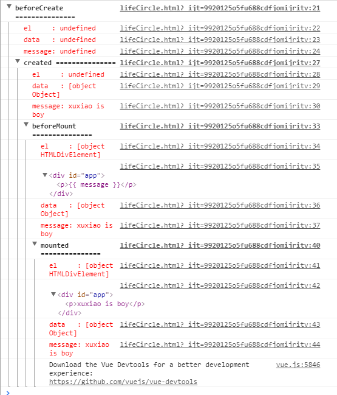

### 示例：
```html
    <div id="app">
        <p>{{ message }}</p>
    </div>
```
```ecmascript 6
    var app = new Vue({
            el: '#app',
            data: {
                message : "xuxiao is boy"
            },
            beforeCreate: function () {
                console.group('beforeCreate ===============');
                console.log("%c%s", "color:red" , "el     : " + this.$el); //undefined
                console.log("%c%s", "color:red","data   : " + this.$data); //undefined
                console.log("%c%s", "color:red","message: " + this.message)
            },
            created: function () {
                console.group('created ===============');
                console.log("%c%s", "color:red","el     : " + this.$el); //undefined
                console.log("%c%s", "color:red","data   : " + this.$data); //已被初始化
                console.log("%c%s", "color:red","message: " + this.message); //已被初始化
            },
            beforeMount: function () {
                console.group('beforeMount ===============');
                console.log("%c%s", "color:red","el     : " + (this.$el)); //已被初始化
                console.log(this.$el);
                console.log("%c%s", "color:red","data   : " + this.$data); //已被初始化
                console.log("%c%s", "color:red","message: " + this.message); //已被初始化
            },
            mounted: function () {
                console.group('mounted ===============');
                console.log("%c%s", "color:red","el     : " + this.$el); //已被初始化
                console.log(this.$el);
                console.log("%c%s", "color:red","data   : " + this.$data); //已被初始化
                console.log("%c%s", "color:red","message: " + this.message); //已被初始化
            },
            beforeUpdate: function () {
                console.group('beforeUpdate ===============');
                console.log("%c%s", "color:red","el     : " + this.$el);
                console.log(this.$el);
                console.log("%c%s", "color:red","data   : " + this.$data);
                console.log("%c%s", "color:red","message: " + this.message);
            },
            updated: function () {
                console.group('updated ===============');
                console.log("%c%s", "color:red","el     : " + this.$el);
                console.log(this.$el);
                console.log("%c%s", "color:red","data   : " + this.$data);
                console.log("%c%s", "color:red","message: " + this.message);
            },
            beforeDestroy: function () {
                console.group('beforeDestroy ===============');
                console.log("%c%s", "color:red","el     : " + this.$el);
                console.log(this.$el);
                console.log("%c%s", "color:red","data   : " + this.$data);
                console.log("%c%s", "color:red","message: " + this.message);
            },
            destroyed: function () {
                console.group('destroyed ===============');
                console.log("%c%s", "color:red","el     : " + this.$el);
                console.log(this.$el);
                console.log("%c%s", "color:red","data   : " + this.$data);
                console.log("%c%s", "color:red","message: " + this.message)
            }
        })
```

### 输出结果：
