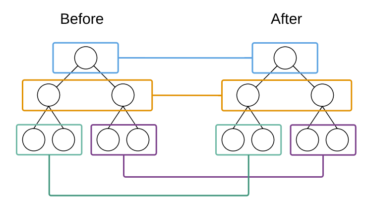
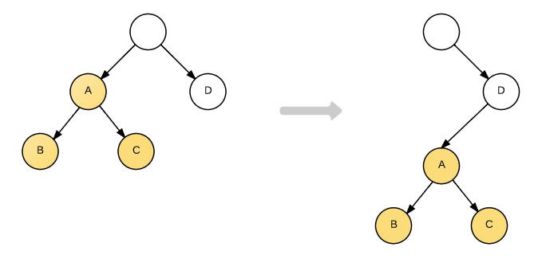

## 什么是DOM Diff算法
即给定任意两棵树，找到最少的转换步骤。但是标准的的Diff算法复杂度需要O(n^3)，这显然无法满足性能要求。但React Diff算法使得算法复杂度直接降低到O(n)
1. 两个相同组件产生类似的DOM结构，不同的组件产生不同的DOM结构；
2. 对于同一层次的一组子节点，它们可以通过唯一的id进行区分。

### 不同节点类型的比较
为了在树之间进行比较，我们首先要能够比较两个节点，在React中即比较两个虚拟DOM节点，当两个节点不同时，应该如何处理。这分为两种情况：
1. 节点类型不同;
2. 节点类型相同，但是属性不同。

当在树中的同一位置前后输出了不同类型的节点，React**直接删除前面的节点，然后创建并插入新的节点**。假设我们在树的同一位置前后两次输出不同类型的节点。

```
   renderA: <div />
   renderB: <span />
   => [removeNode <div />], [insertNode <span />] 
```

需要注意的是，删除节点意味着彻底销毁该节点，而不是再后续的比较中再去看是否有另外一个节点等同于该删除的节点。如果该删除的节点之下有子节点，那么这些子节点也会被完全删除，它们也不会用于后面的比较。这也是算法复杂能够降低到O（n）的原因。

上面提到的是对虚拟DOM节点的操作，而同样的逻辑也被用在React组件的比较，例如：

```
    renderA: <Header />
    renderB: <Content />
    => [removeNode <Header />], [insertNode <Content />]
```

当React在同一个位置遇到不同的组件时，也是简单的销毁第一个组件，而把新创建的组件加上去。这正是应用了第一个假设，不同的组件一般会产生不一样的DOM结构，与其浪费时间去比较它们基本上不会等价的DOM结构，还不如完全创建一个新的组件加上去。

由这一React对不同类型的节点的处理逻辑我们很容易得到推论，那就是**React的DOM Diff算法实际上只会对树进行逐层比较**。

### 逐层进行节点比较
在React中，两棵树只会对同一层次的节点进行比较。如下图所示：


React只会对相同颜色方框内的DOM节点进行比较，即同一个父节点下的所有子节点。**当发现节点已经不存在，则该节点及其子节点会被完全删除掉，不会用于进一步的比较**。这样只需要对树进行一次遍历，便能完成整个DOM树的比较。

例如，考虑有下面的DOM结构转换：


A节点被整个移动到D节点下，直观的考虑DOM Diff操作应该是

```
    A.parent.remove(A); 
    D.append(A);
```

但因为React只会简单的考虑同层节点的位置变换，对于不同层的节点，只有简单的创建和删除。当根节点发现子节点中A不见了，就会直接销毁A；而当D发现自己多了一个子节点A，则会创建一个新的A作为子节点。因此对于这种结构的转变的实际操作是：

```
    A.destroy();
    A = new A();
    A.append(new B());
    A.append(new C());
    D.append(A);
    //可以看到，以A为根节点的树被整个重新创建。
    //基于两个不同组件一般产生不一样的DOM结构
```

### 相同类型节点的比较
React会对相同类型的节点的属性进行重设从而实现节点的转换。例如：

```
    renderA: <div id="before" />
    renderB: <div id="after" />
    => [replaceAttribute id "after"]
```

虚拟DOM的style属性稍有不同，其值并不是一个简单字符串而必须为一个对象，因此转换过程如下：

```
    renderA: <div style={{color: 'red'}} />
    renderB: <div style={{fontWeight: 'bold'}} />
    => [removeStyle color], [addStyle font-weight 'bold']
```

### 由DOM Diff算法理解组件的生命周期
每个生命周期其实都是和DOM  Diff算法息息相关的。例如：
- constructor: 构造函数，组件被创建时执行；
- componentDidMount: 当组件添加到DOM树之后执行；
- componentWillUnmount: 当组件从DOM树中移除之后执行，在React中可以认为组件被销毁；
- componentDidUpdate: 当组件更新时执行。

当DOM树进行如下转变时，即从“shape1”转变到“shape2”时。我们来观察这几个方法的执行情况：


浏览器开发工具控制台输出如下结果：

    C will unmount.
    C is created.
    B is updated.
    A is updated.
    C did mount.
    D is updated.
    R is updated.
    
可以看到，C节点是完全重建后再添加到D节点之下，而不是将其“移动”过去。

### 列表节点的比较
当节点在同一层时，又是如何处理的呢？这就涉及到列表节点的Diff算法。相信很多使用React的同学大多遇到过这样的警告：


这是React在遇到列表时却又找不到key时提示的警告。

**React 提出优化策略：允许开发者对同一层级的同组子节点，添加唯一 key 进行区分。**

列表节点的操作通常包括添加、删除和排序。例如下图，我们需要往B和C直接插入节点F，在React中，我们只会告诉React新的界面应该是A-B-F-C-D-E，由Diff算法完成更新界面。


这时如果每个节点都没有唯一的标识，React无法识别每一个节点，那么更新过程会很低效，即，将C更新成F，D更新成C，E更新成D，最后再插入一个E节点。效果如下图所示：


可以看到，React会逐个对节点进行更新，转换到目标节点。而最后插入新的节点E，涉及到的DOM操作非常多。而如果给每个节点唯一的标识（key），那么React能够找到正确的位置去插入新的节点，入下图所示：


对于列表节点顺序的调整其实也类似于插入或删除，下面结合示例我们看下将树的形态从shape3转换到shape4：


即将同一层的节点位置进行调整。如果未提供key，那么React认为B和C之后的对应位置组件类型不同，因此完全删除后重建，控制台输出如下：

    B will unmount.
    C will unmount.
    C is created.
    B is created.
    C did mount.
    B did mount.
    A is updated.
    R is updated.
    
而如果提供了key，如下面的代码：

```
    shape5: function() {
      return (
        <Root>
          <A>
            <B key="B" />
            <C key="C" />
          </A>
        </Root>
      );
    },
    
    shape6: function() {
      return (
        <Root>
          <A>
            <C key="C" />
            <B key="B" />
          </A>
        </Root>
      );
    },
```

那么控制台输出如下：

    C is updated.
    B is updated.
    A is updated.
    R is updated.
    
可以看到，对于列表节点提供唯一的key属性可以帮助React定位到正确的节点进行比较，从而大幅减少DOM操作次数，提高了性能。

我们通过示例查看添加、删除和排序的三个过程：


## 总结
- React 通过制定大胆的 diff 策略，将 O(n3) 复杂度的问题转换成 O(n) 复杂度的问题；

- React 通过分层求异的策略，对 tree diff 进行算法优化；

- React 通过相同类生成相似树形结构，不同类生成不同树形结构的策略，对 component diff 进行算法优化；

- React 通过设置唯一 key的策略，对 element diff 进行算法优化；

- 建议，在开发组件时，保持稳定的 DOM 结构会有助于性能的提升；

- 建议，在开发过程中，尽量减少类似将最后一个节点移动到列表首部的操作，当节点数量过大或更新操作过于频繁时，在一定程度上会影响 React 的渲染性能。